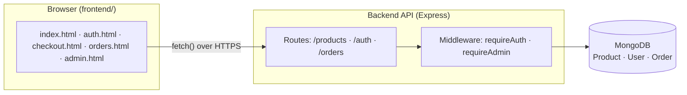

# ShopLite — Architecture Overview

## System diagram

## Request flow example: placing an order

1. Shopper clicks "Place Order" on `checkout.html`.
2. `checkout.js` sends `POST /orders` with `{ items: [{ productId, quantity }] }`
   and the shopper's JWT in the `Authorization` header.
3. `requireAuth` middleware verifies the JWT and attaches `req.userId`.
4. The `/orders` route looks up each product's **current, real price**
   from MongoDB — never trusting any price from the request — checks
   stock, decrements it, and builds the order.
5. The order is saved with a **snapshot** of each item's name/price at
   that moment, plus a live reference to the product.
6. The response includes the new order's id; the frontend clears the
   cart and shows a confirmation.

## Why these specific design decisions

- **Price/name snapshotting on orders** (Day 26): so a later price change
  never rewrites what a past order shows as having been paid.
- **Server-side price/stock enforcement** (Day 27): the client can never
  dictate what something costs — only which product and how many.
- **`requireAdmin` re-checks the database every request** (Day 31) rather
  than trusting a flag inside the JWT, so revoking admin access is
  immediate, not delayed until the token expires.
- **No API route to grant admin access** (Day 31): the highest-privilege
  action in the system is a manual script run directly against the
  database, not reachable through the app itself.
- **One centralized frontend config** (`config.js`, Day 36): environment
  detection lives in exactly one file, instead of duplicated across every
  page that calls the API.

## Data models (simplified)

**Product**: name, price, category, image, stock, timestamps.

**User**: name, email (unique), password (bcrypt hash, never plain text),
isAdmin, timestamps.

**Order**: user (ref), items (array of `{ product ref, name, price,
quantity }` — name/price are snapshots), total, status (enum: pending /
shipped / completed / cancelled), timestamps.

## Known limitations (honest, not hidden)

- `POST /orders` updates each product's stock in a loop with no database
  transaction — if an item partway through fails, earlier items in the
  same order have already had their stock reduced. A production system
  would wrap this in a MongoDB transaction; out of scope for this
  project, but worth knowing the gap exists (see Day 27's tutorial).
- There's no password-reset flow — a real product would need one.
- No pagination on `GET /products` or `GET /orders/admin/all` — fine at
  this scale, would need addressing if the catalog or order volume grew
  significantly.
